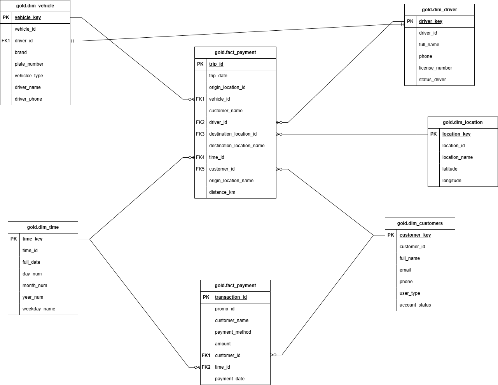
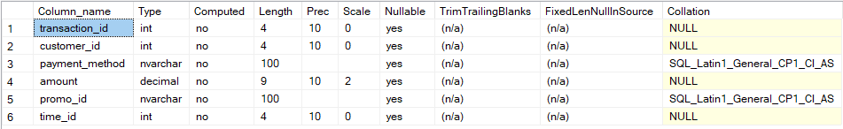
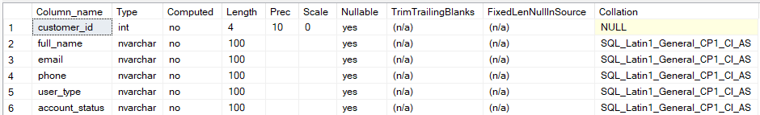
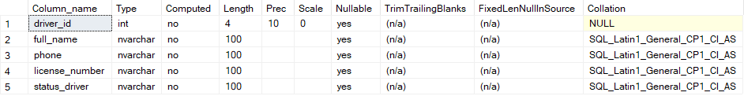
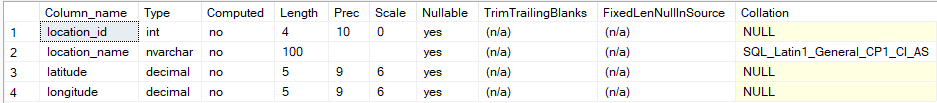
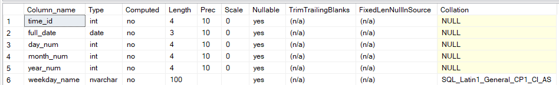
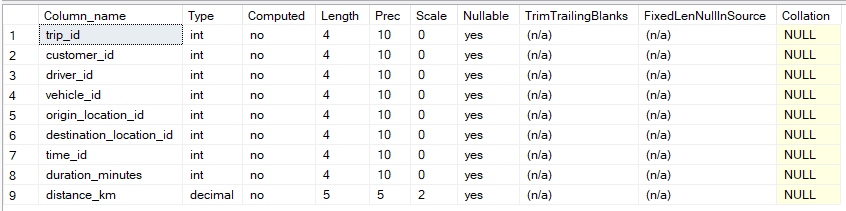
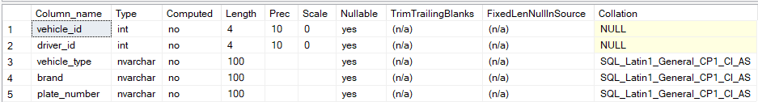

<h2 style="text-align: center;">BAB I</h2>
<h3 style="text-align: center;">PROFIL INDUSTRI DAN MASALAH BISNIS</h3>

### A. Ride-Hailing
Industri layanan transportasi berbasis aplikasi adalah sektor yang menghubungkan penumpang dan pengemudi secara langsung melalui platform digital tanpa kepemilikan armada oleh penyedia layanan. Sektor ini telah mengubah cara mobilitas urban dengan memanfaatkan teknologi seperti GPS, pembayaran digital, dan algoritma pencocokan permintaan-penawaran yang diperkuat oleh kecerdasan buatan. Model bisnisnya berfokus pada efisiensi operasional, pemanfaatan data dalam skala besar, dan fleksibilitas tenaga kerja, sehingga dapat menyediakan layanan transportasi yang lebih cepat, personal, dan terjangkau dibandingkan transportasi tradisional. Seiring perkembangannya, industri ini menghadapi berbagai perhatian, termasuk regulasi, perlindungan data, model kerja fleksibel yang sering memicu perdebatan hukum, serta tantangan keberlanjutan lingkungan di tengah pertumbuhan global yang cepat. Analisis ekosistem layanan ini menunjukkan bahwa keberhasilannya sangat bergantung pada desain infrastruktur data yang tepat dan sistem pengambilan keputusan berbasis analitik.

### B. Masalah bisnis yang dihadapi 
1. Kesulitan Memprediksi Permintaan
Keterbatasan sistem prediksi membuat pelaku industri ride-hailing sulit mengantisipasi
lonjakan permintaan secara akurat di waktu atau lokasi tertentu. Akibatnya, sering terjadi
ketidakseimbangan antara jumlah pengemudi dan penumpang yang berdampak pada
meningkatnya waktu tunggu, ketidakpuasan pengguna, dan kehilangan potensi
pendapatan.

2. Tantangan dalam Skalabilitas Sistem Laporan
Peningkatan volume data operasional yang pesat tidak diimbangi dengan sistem
pelaporan yang andal dan terpusat. Akibatnya, laporan bisnis seringkali lambat, tidak
sinkron antar departemen, dan rawan inkonsistensi, yang menyulitkan proses monitoring
dan evaluasi berkala.

3. Minimnya Visibilitas Kinerja Operasional
Kurangnya integrasi data lintas fungsi membuat perusahaan kesulitan memantau
performa armada, aktivitas pengemudi, serta kepuasan pengguna secara menyeluruh. Hal
ini menyebabkan proses evaluasi kinerja menjadi lambat dan tidak akurat, sehingga
menghambat pengambilan keputusan strategis secara real-time.

4. Kesulitan Mendeteksi Anomali atau Fraud
Ketidakterpaduan data transaksi dan aktivitas pengguna menyebabkan deteksi terhadap
pola anomali atau indikasi kecurangan berjalan lambat. Hal ini berpotensi menimbulkan
kerugian operasional yang besar serta menurunkan kepercayaan pengguna terhadap
keamanan platform.

<h2 style="text-align: center;">BAB II</h2>
<h3 style="text-align: center;">DAFTAR STAKEHOLDER DAN TUJUAN BISNIS</h3>

### A. Daftar Stakeholder Utama
Berikut pemangku kepentingan kunci dalam bisnis ride-hailing (Uber) beserta peran dan
kebutuhan mereka:

| stakeholder | peran  | tujan bisnis |
|---------|------------|---------|
| manajemen eksekutif       | CEO, Direktur, VP Operasional | Mengambil keputusan strategis berbasis data      |
| tim operasional       | Pengelola armada, manajer wilayah | Mengoptimalkan penyebaran driver      | 
| tim data dan bi       | Data analyst, BI engineer, data scientist | Membangun dashboard dan laporan      | 

<h2 style="text-align: center;">BAB III</h2>
<h3 style="text-align: center;">FAKTA DAN DIMENSI</h3>

| kebutuhan bisnis | fakta  | dimensi | stakeholder |
|---------|------------|---------|---------|
| Analisis Revenue Harian/Bulanan | fact_payment (amount) | Mengambil dim_time (full_date, month_num, year_num) | Manajemen Eksekutif, Tim Keuangan |
| Monitoring Jumlah Trip per Hari | fact_trip (trip_id - count) | dim_time (full_date, weekday_name) | Tim Operasional, Manajemen Eksekutif |
| Analisis Performa Driver | fact_trip (duration_minutes, distance_km) | dim_driver (full_name, status_driver) | Tim Operasional |
| Optimasi Penyebaran Armada | fact_trip (trip_id - count) | dim_location (location_name, latitude, longitude) | Tim Operasional |
| Trend Permintaan per Lokasi | fact_trip (trip_id - count) | dim_location (location_name), dim_time (weekday_name) | Tim Operasional, Manajemen |

### B. Diagram Star skema (fakta dan dimensi)

<h2 style="text-align: center;">BAB IV</h2>
<h3 style="text-align: center;">FAKTA DAN DIMENSI</h3>

Untuk industri layanan transportasi berbasis aplikasi, perancangan data gudang didasarkan pada integrasi berbagai sumber data yang mencerminkan aktivitas operasional, transaksi, serta karakteristik pengemudi dan pengguna. Sumber data utama berasal dari sistem internal platform, yang mencatat interaksi pengguna, transaksi keuangan, dan seluruh proses perjalanan secara real-time. Beberapa sumber data utama yang dimanfaatkan meliputi:  
1. Log transaksi perjalanan  
2. Aktivitas pengemudi  
3. Data transaksi keuangan  
4. Profil pengguna dan pengemudi  
5. Data waktu dan lokasi

<h4 style="text-align: center;">crm_payment_transaction_detail</h4>

<h4 style="text-align: center;">crm_customer_info</h4>

<h4 style="text-align: center;">erp_driver_info</h4>

<h4 style="text-align: center;">erp_location_info</h4>

<h4 style="text-align: center;">erp_time_info</h4>

<h4 style="text-align: center;">erp_trip_detail</h4>

<h4 style="text-align: center;">erp_vehicle_info</h4>
