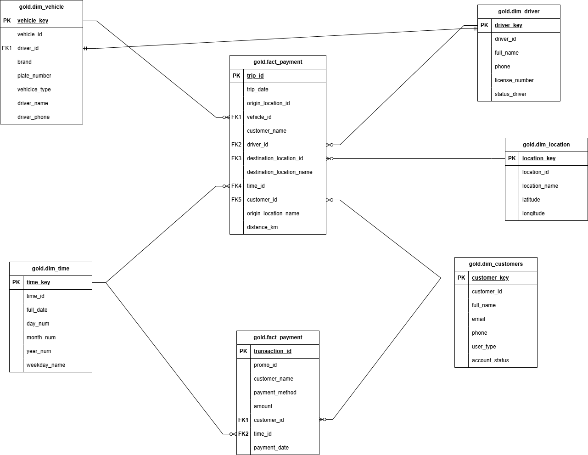
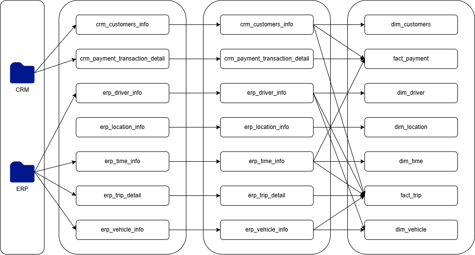

## BAB IV
### Ringkasan kebutuhan bisnis
#### Konteks Bisnis
Industri ride-hailing beroperasi dalam lingkungan yang dinamis yang memerlukan kemampuan pengambilan keputusan secara real-time dan analitik yang komprehensif. Solusi data warehouse kami mengatasi tantangan bisnis kritis melalui manajemen data terintegrasi dan kemampuan pelaporan strategis.

#### Masalah Bisnis Utama yang Diatasi
- Tantangan Prediksi Permintaan: Ketidakmampuan untuk memprediksi lonjakan permintaan secara akurat menyebabkan ketidakseimbangan supply-demand, meningkatnya waktu tunggu, dan kehilangan pendapatan. Solusi kami menyediakan kemampuan analisis tren historis dan pengenalan pola.

- Skalabilitas Sistem Pelaporan: Pertumbuhan volume data operasional yang cepat membebani infrastruktur pelaporan yang ada, menyebabkan keterlambatan dan inkonsistensi. Arsitektur medallion (Bronze-Silver-Gold) memastikan pelaporan yang scalable dan andal.

- Visibilitas Kinerja Operasional: Kurangnya data lintas fungsi yang terintegrasi mencegah pemantauan komprehensif terhadap kinerja armada, aktivitas pengemudi, dan kepuasan pengguna. Desain star schema kami memungkinkan wawasan operasional 360 derajat.

| stakeholder utama | tujuan  |
|---------|------------|
| manajemen eksekutif | Pengambilan keputusan strategis melalui analisis pendapatan komprehensif dan KPI operasional |
| tim operasional     | Optimasi armada, pemantauan kinerja pengemudi, dan analisis distribusi permintaan |
| tim data & BI       | Pengembangan dashboard yang efisien dan kemampuan analitik lanjutan |

## BAB V
### Skema Konseptual Multidimensional
#### Arsitektur Star Schema
Data warehouse kami mengimplementasikan star schema klasik dengan dua tabel fakta di pusat, dikelilingi oleh lima tabel dimensi:

#### Ringkasan Komponen Schema
Tabel Fakta:
| tabel |  | 
|---------|------------|
| fact_trip | Metrik operasional inti termasuk durasi perjalanan, jarak, dan hubungan lokasi |
| fact_payment | Data transaksi keuangan dengan metode pembayaran dan jumlah |

Tabel Dimensi:
| tabel | full_date  | 
|---------|------------|
| dim_customers | Profil pelanggan dan informasi akun | 
| dim_driver | Detail pengemudi dan informasi status | 
| dim_vehicle | Spesifikasi kendaraan dan penugasan pengemudi |
| dim_location | Data referensi geografis dengan koordinat |
| dim_time | Dimensi temporal yang mendukung analisis berbasis waktu |   

## BAB VI
### Analisis Komponen Detail
#### Tabel Fakta
#### fact_trip
Tujuan: Menangkap metrik operasional inti ride-hailing
Metrik Utama:
- Durasi perjalanan (duration_minutes)
- Jarak tempuh (distance_km)
- Frekuensi perjalanan (jumlah trip_id)
Hubungan: Menghubungkan pelanggan, pengemudi, kendaraan, lokasi (asal/tujuan), dan waktu
Nilai Bisnis: Memungkinkan analisis kinerja, optimasi rute, dan identifikasi pola permintaan

#### fact_payment
Tujuan: Mencatat semua transaksi keuangan dalam platform
Metrik Utama:
- Jumlah transaksi (amount)
- Distribusi metode pembayaran
- Penggunaan promosi (promo_id)
Hubungan: Menghubungkan pelanggan dengan data temporal untuk analitik keuangan
Nilai Bisnis: Mendukung analisis pendapatan, pemantauan tren pembayaran, dan pengukuran efektivitas promosi

#### dim_customers
1. Atribut: Profil pelanggan termasuk informasi kontak, jenis pengguna, dan status akun
2. Peran Bisnis: Segmentasi pelanggan, analisis perilaku pengguna, dan dukungan pemasaran terarah
3. Field Utama: customer_key (surrogate), customer_id (natural), full_name, email, user_type, account_status

#### dim_driver
1. Atribut: Informasi pengemudi termasuk lisensi, detail kontak, dan status operasional
2. Peran Bisnis: Evaluasi kinerja pengemudi, alokasi sumber daya, dan pemantauan kepatuhan
3. Field Utama: driver_key (surrogate), driver_id (natural), full_name, license_number, status_driver

#### dim_vehicle
1. Atribut: Spesifikasi kendaraan dengan penugasan pengemudi dan detail armada
2. Peran Bisnis: Manajemen armada, penjadwalan pemeliharaan, dan optimasi sumber daya
3. Field Utama: vehicle_key (surrogate), vehicle_id (natural), vehicle_type, brand, plate_number
4. Fitur Khusus: Termasuk informasi pengemudi yang dinormalisasi untuk efisiensi pelaporan

#### dim_location
1. Atribut: Data referensi geografis dengan koordinat dan nama lokasi
2. Peran Bisnis: Analisis spasial, optimasi rute, dan identifikasi area pasar
3. Field Utama: location_key (surrogate), location_id (natural), location_name, latitude, longitude

#### dim_time
1. Atribut: Data temporal komprehensif yang mendukung berbagai analisis berbasis waktu
2. Peran Bisnis: Analisis tren, identifikasi pola musiman, dan pelaporan berbasis waktu
3. Field Utama: time_key (surrogate), time_id (natural), full_date, day_num, month_num, year_num, weekday_name

## BAB VII
### Justifikasi Desain Konseptual
#### Rasional Pemilihan Star Schema
1. Optimasi Kinerja Query: Star schema meminimalkan join yang diperlukan untuk query analitik, penting untuk kinerja dashboard real-time dalam lingkungan ride-hailing yang bergerak cepat.
2. Aksesibilitas Pengguna Bisnis: Struktur yang intuitif memungkinkan pengguna bisnis memahami hubungan dengan mudah, memungkinkan kemampuan analitik self-service.
3. Pertimbangan Skalabilitas: Tabel fakta terpisah untuk data operasional (perjalanan) dan keuangan (pembayaran) mencegah degradasi kinerja seiring meningkatnya volume transaksi.

### Implementasi Surrogate Key
1. Manfaat Integrasi Data: Surrogate key (customer_key, driver_key, dll.) memungkinkan integrasi data yang mulus dari berbagai sistem sumber (CRM, ERP) tanpa konflik natural key.
2. Manajemen Data Historis: Surrogate key mendukung penanganan slowly changing dimension, penting untuk melacak perubahan status pengemudi dan evolusi profil pelanggan.
3. Peningkatan Kinerja: Surrogate key integer memberikan kinerja join yang lebih cepat dibandingkan dengan alternatif natural key.

### Strategi Denormalisasi
- Peningkatan dim_vehicle: Memasukkan informasi pengemudi langsung dalam dimensi kendaraan mengurangi join untuk query manajemen armada yang umum.
- Inklusi Nama Lokasi: Menambahkan nama lokasi ke tabel fakta menghilangkan lookup dimensi yang sering untuk pelaporan berbasis lokasi.

### Logika Pemisahan Tabel Fakta
- Pemisahan Operasional vs Keuangan: Tabel fakta yang berbeda selaras dengan frekuensi analitik yang berbeda dan grup pengguna, mengoptimalkan kinerja query untuk use case spesifik.
- Definisi Grain: Setiap tabel fakta mempertahankan grain yang konsisten - level perjalanan untuk operasi, level transaksi untuk pembayaran - memastikan agregasi yang akurat.

## BAB VIII
### Analisis Kesesuaian Sumber Data
#### Pemetaan Sistem Sumber
##### Integrasi Sistem CRM
- crm_customer_info → dim_customers: Pemetaan langsung dengan peningkatan kualitas data
- crm_payment_transaction_detail → fact_payment: Integrasi data keuangan level transaksi

#### Integrasi Sistem ERP
- erp_driver_info → dim_driver: Data master pengemudi dengan normalisasi status
- erp_vehicle_info → dim_vehicle: Informasi armada dengan pemetaan hubungan pengemudi
- erp_location_info → dim_location: Standardisasi data referensi geografis
- erp_time_info → dim_time: Populasi dimensi temporal
- erp_trip_detail → fact_trip: Integrasi metrik operasional inti

#### Kesesuaian Kualitas Data

1. Pemrosesan Layer Bronze
Ingestion data mentah mempertahankan fidelitas sistem sumber sambil menangkap semua informasi yang tersedia untuk pemrosesan downstream.

2. Transformasi Layer Silver
Standardisasi Data: Normalisasi nomor telepon, validasi email, dan standardisasi kode status memastikan konsistensi di seluruh sistem sumber.

3. Resolusi Duplikat: Logika deduplikasi lanjutan menghapus record redundan sambil mempertahankan integritas data.

4. Aturan Validasi: Validasi data komprehensif memastikan hanya record berkualitas tinggi yang melanjutkan ke gold layer.

5. Optimasi Layer Gold
    - View Siap Bisnis: Layer final menyajikan data yang bersih dan terintegrasi yang dioptimalkan untuk konsumsi analitik.
    - Integritas Hubungan: Hubungan foreign key mempertahankan integritas referensial di seluruh star schema.

#### Penyelarasan Proses ETL
Arsitektur medallion tiga layer memastikan lineage data dan pelacakan transformasi yang tepat:
- Layer Bronze: Mempertahankan struktur dan tipe data sistem sumber
- Layer Silver: Menerapkan aturan bisnis dan peningkatan kualitas data
- Layer Gold: Menyajikan model dimensional yang dioptimalkan untuk analitik
Pendekatan ini menyediakan traceability penuh dari sistem sumber ke output analitik sambil mempertahankan kualitas data dan transparansi transformasi.