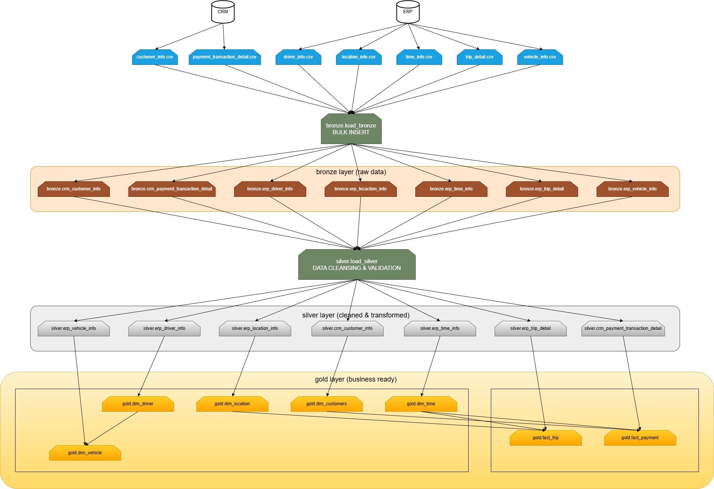

flowchart ini menggambarkan pipeline ETL tiga tingkat yang mengikuti pola Arsitektur Medal untuk data warehouse transportasi/ride-sharing:
## Proses Alur Data:

- Pengambilan Data (Sumber → Bronze)
- Data mentah dari sistem CRM dan ERP diekspor ke file CSV.
- Prosedur bronze.load_bronze melakukan operasi BULK INSERT untuk memuat semua file CSV ke dalam tabel-tabel lapisan Bronze.
- Data disimpan persis seperti yang diterima tanpa transformasi apa pun - berfungsi sebagai "sumber kebenaran tunggal".

Lapisan Bronze memuat file CSV mentah menggunakan prosedur tersimpan bronze.load_bronze:
```sql
-- Example from load_bronze.sql
BULK INSERT bronze.crm_customer_info
FROM 'C:\data_warehouse_project26\datasets\source_crm\customer_info.csv'
WITH (
    FIRSTROW = 2,
    FIELDTERMINATOR = ';',
    TABLOCK
);
```

Proses: Setiap file CSV dimuat ke dalam tabel Bronze yang sesuai dengan perintah TRUNCATE (menghapus data yang sudah ada) diikuti oleh BULK INSERT. Prosedur ini mencakup pengukuran waktu dan penanganan kesalahan

```sql
BEGIN TRY
    SET @batch_start_time = GETDATE();
    -- Load operations here
    SET @batch_end_time = GETDATE();
    PRINT 'Total Load Duration: ' + CAST(DATEDIFF(SECOND, @batch_start_time, @batch_end_time) AS NVARCHAR) + ' seconds';
END TRY
BEGIN CATCH
    PRINT 'ERROR OCCURED DURING LOADING BRONZE LAYER'
    PRINT 'Error Message' + ERROR_MESSAGE();
END CATCH
);
```

## Pembersihan dan Transformasi Data (Bronze → Silver)
Prosedur silver.load_silver menerapkan aturan kualitas data yang komprehensif:
- Standarisasi: Format nomor telepon, email, dan teks.
- Validasi: Pemeriksaan tipe data, validasi rentang, dan integritas referensial.
- Deduplikasi: Menghapus rekaman duplikat berdasarkan kunci bisnis.
- Pembersihan: Memperbaiki inkonsistensi data dan menangani nilai null.
Semua operasi dibungkus dalam transaksi untuk menjaga konsistensi data.

standarisasi nomor telepon
```sql
-- Normalize phone numbers to +62 format
UPDATE bronze.crm_customer_info
SET phone = '+62' + REPLACE(REPLACE(REPLACE(REPLACE(REPLACE(phone, '+62', ''), ' ', ''), '-', ''), '(', ''), ')', '')
WHERE phone IS NOT NULL;
```
email cleaning
```sql
-- Remove double dots and fix comma issues
WHILE EXISTS (SELECT 1 FROM bronze.crm_customer_info WHERE email LIKE '%..%')
BEGIN
    UPDATE bronze.crm_customer_info
    SET email = REPLACE(email, '..', '.')
    WHERE email LIKE '%..%';
END;

UPDATE bronze.crm_customer_info
SET email = REPLACE(email, ',', '.');
```
data standarisasi
```sql
-- Capitalize user types and account status
UPDATE bronze.crm_customer_info
SET user_type = UPPER(user_type),
    account_status = UPPER(account_status);
```
penghapusan duplikat
```sql
-- Remove duplicates based on email
WITH Duplicates AS (
    SELECT *, ROW_NUMBER() OVER (PARTITION BY email ORDER BY customer_id DESC) AS rn
    FROM bronze.crm_customer_info
)
DELETE FROM Duplicates WHERE rn > 1;
```
data validasi dan transfer
```sql
-- Insert only valid records to Silver
INSERT INTO silver.crm_customer_info (customer_id, full_name, email, phone, user_type, account_status)
SELECT customer_id, TRIM(full_name), LOWER(email), phone, user_type, account_status
FROM bronze.crm_customer_info
WHERE full_name IS NOT NULL
  AND email IS NOT NULL
  AND phone IS NOT NULL
  AND user_type IS NOT NULL
  AND account_status IS NOT NULL;
```

## Pembuatan Lapisan Bisnis (Silver → Gold)
- Membuat model dimensional skema bintang yang dioptimalkan untuk analitik.
- Tabel Dimensi: Dimensi Pelanggan, Pengemudi, Kendaraan, Lokasi, dan Waktu dengan kunci pengganti (surrogate keys).
- Tabel Fakta: Fakta Perjalanan dan Pembayaran dengan ukuran (measures) dan hubungan kunci asing.
- Diimplementasikan sebagai view untuk akses real-time ke data Silver yang telah dibersihkan.

tabel dimensi dengan surrogate key
```sql
-- Customer dimension with surrogate key
CREATE VIEW gold.dim_customers AS
SELECT 
    ROW_NUMBER() OVER (ORDER BY customer_id) AS customer_key,
    customer_id, full_name, email, phone, user_type, account_status
FROM silver.crm_customer_info;
```
complex dimension dengan join
```sql
-- Vehicle dimension joined with driver information
CREATE VIEW gold.dim_vehicle AS
SELECT
    ROW_NUMBER() OVER (ORDER BY vehicle_id) AS vehicle_key,
    v.vehicle_id, v.vehicle_type, v.brand, v.plate_number,
    d.driver_id, d.full_name AS driver_name, d.phone AS driver_phone
FROM silver.erp_vehicle_info v
LEFT JOIN gold.dim_driver d ON v.driver_id = d.driver_id;
```

tabel fakta dengan konteks bisnis
```sql
-- Trip fact table with dimensional context
CREATE VIEW gold.fact_trip AS
SELECT
    t.trip_id, t.customer_id, t.driver_id, t.vehicle_id,
    t.origin_location_id, ori.location_name AS origin_location_name,
    t.destination_location_id, dest.location_name AS destination_location_name,
    t.time_id, ti.full_date AS trip_date,
    t.duration_minutes, t.distance_km
FROM silver.erp_trip_detail t
LEFT JOIN gold.dim_location ori ON t.origin_location_id = ori.location_id
LEFT JOIN gold.dim_location dest ON t.destination_location_id = dest.location_id
LEFT JOIN gold.dim_time ti ON t.time_id = ti.time_id;
```

error handling & manajemen transaksi
```sql
CREATE PROCEDURE silver.load_silver AS
BEGIN
    BEGIN TRY
        BEGIN TRANSACTION;
        
        -- All transformation logic here
        
        COMMIT;
    END TRY
    BEGIN CATCH
        ROLLBACK;
        THROW;
    END CATCH
END;
```
contoh khusus kualitas data
- location data cleaning
```sql
-- Standardize location names
UPDATE bronze.erp_location_info
SET location_name = LOWER(TRIM(location_name));

-- Remove punctuation and standardize abbreviations
UPDATE bronze.erp_location_info
SET location_name = REPLACE(REPLACE(location_name, ',', ''), '.', '');

UPDATE bronze.erp_location_info
SET location_name = REPLACE(location_name, 'gg', 'gang ');
```
standarisasi metode pembayaran
```sql
-- Standardize payment methods
UPDATE bronze.crm_payment_transaction_detail
SET payment_method = LOWER(
    CASE 
        WHEN payment_method LIKE '%creditcard%' THEN 'credit card'
        WHEN payment_method LIKE '%e-wallet%' THEN 'e-wallet'
        WHEN payment_method LIKE '%e-cash%' THEN 'e-wallet' 
        ELSE payment_method
    END
);
```
Manfaat Arsitektur Utama dalam Kode:
1. pemisahan concerns: Setiap lapisan memiliki tanggung jawab yang berbeda.
2. Data Lineage: Data mentah disimpan di lapisan Bronze untuk pemrosesan ulang.
3. Pemeriksaan Kualitas (Quality Gates): Lapisan Silver memvalidasi data sebelum digunakan di lapisan Gold.
4. Performance: Menggunakan BULK INSERT untuk Bronze, serta view yang dioptimalkan untuk Gold.
5. Maintainability (Kemudahan Pemeliharaan): Prosedur tersimpan yang modular untuk setiap langkah transformasi.