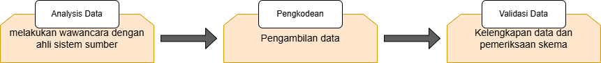
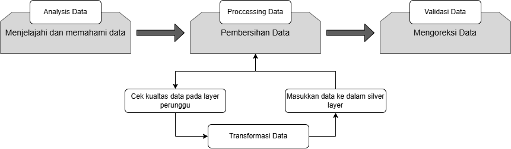
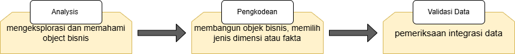

## Tujuan Implementasi

Implementasi ini bertujuan untuk membangun gudang data di SQL Server yang mendukung analitik dan pelaporan bisnis menggunakan pendekatan Medallion Architecture.
Fokus pada pengelolaan data dari source system (CRM dan ERP) melalui lapisan Bronze (data mentah), Silver (data terkurasi), hingga Gold (data siap bisnis), dengan struktur star schema untuk efisiensi analitik.
Memenuhi spesifikasi yang diberikan, termasuk pembuatan tabel fakta dan dimensi, relasi antar tabel, indexing, dan penyimpanan skrip di GitHub.

## Lingkungan Implementasi
Menjelaskan lingkungan teknis yang digunakan untuk implementasi.

Database: Microsoft SQL Server.
Nama Database: RideHailingDW.
Skema:
bronze: Untuk data mentah dari source system.
silver: Untuk data yang telah dibersihkan dan distandarisasi.
gold: Untuk data siap bisnis dengan star schema.
Alat: SQL Server Management Studio (SSMS) untuk menjalankan skrip SQL, Git untuk version control, dan GitHub untuk penyimpanan repositori.

## Langkah-langkah Implementasi

### Analisis Data

1. Deskripsi: Tahap ini melibatkan eksplorasi dan pemahaman data untuk mengidentifikasi kebutuhan bisnis dan struktur data yang sesuai.

2. Aktivitas:
- Identifikasi kebutuhan bisnis melalui wawancara dengan ahli sistem sumber.
- Eksplorasi dataset mentah dari CRM dan ERP.
- Pemetaan struktur tabel awal untuk Bronze Layer.

3. Hasil: Dokumentasi awal kebutuhan data dan struktur tabel mentah di DDL_bronze.sql.

### Pengodean
1. Deskripsi: Tahap ini melibatkan pengembangan dan pemrosesan data, termasuk pengambilan, pembersihan, dan transformasi data.

2. Aktivitas:
- Pengambilan Data (Bronze Layer): Menggunakan bronze.load_bronze untuk memuat data mentah dari file CSV.
- Pembersihan Data (Silver Layer): Menjalankan silver.load_silver untuk normalisasi, penghapusan duplikat, dan validasi data.
- Transformasi Data (Gold Layer): Membuat view di ddl_gold.sql untuk struktur star schema.

3. Hasil: Data terproses dari Bronze ke Silver, dan siap bisnis di Gold Layer.

### Validasi Data

1. Deskripsi: Tahap ini melibatkan validasi dan pengujian integrasi data untuk memastikan kualitas dan konsistensi.

2. Aktivitas:
- Pemeriksaan Kualitas Data (Bronze Layer): Memverifikasi kelengkapan data mentah.
- Validasi Data (Silver Layer): Memeriksa hasil pembersihan dan standarisasi.
- Pemeriksaan Integrasi Data (Gold Layer): Menguji view untuk memastikan integrasi yang benar.

3. Hasil: Data divalidasi dan siap untuk analitik dengan skema star schema terverifikasi.

## Pembuatan Skema Database
### Skema Bronze Layer:
Membuat skema bronze untuk menyimpan data mentah dari source system (CRM dan ERP).
Tabel yang dibuat meliputi:
- bronze.crm_customer_info: Data pelanggan dari CRM
- bronze.crm_payment_transaction_detail: Data transaksi pembayaran dari CRM.
- bronze.erp_driver_info, bronze.erp_vehicle_info, bronze.erp_location_info, bronze.erp_time_info, bronze.erp_trip_detail: Data operasional dari ERP.
- Skrip: DDL_bronze.sql

### Skema Silver Layer:
Membuat skema silver untuk menyimpan data yang telah dibersihkan dan distandarisasi dari Bronze Layer.
Tabel yang dibuat meliputi:
- silver.crm_customer_info, silver.crm_payment_transaction_detail 
- silver.erp_driver_info, silver.erp_location_info, silver.erp_time_info, silver.erp_trip_detail, silver.erp_vehicle_info.
Skrip: DDL_silver.sql, dengan kolom tambahan dwh_create_date untuk mencatat waktu pembuatan data.

### Skema Gold Layer:

Membuat skema gold untuk data siap bisnis menggunakan star schema.
Tabel dibuat sebagai view berdasarkan data Silver Layer, meliputi:
- gold.dim_customers, gold.dim_driver, gold.dim_vehicle, gold.dim_location, gold.dim_time (tabel dimensi).
- gold.fact_trip, gold.fact_payment (tabel fakta).
- Skrip: DDL_gold.sql.

### Pembuatan Tabel Fakta dan Dimensi
- Bronze Layer:
Tabel dibuat menggunakan skrip DDL_bronze.sql, yang mencakup struktur tabel mentah tanpa kunci asing untuk menjaga integritas data asli.
Contoh struktur tabel bronze.crm_payment_transaction_detail:

| Kolom          | Type Data    | Keterangan             |
|----------------|--------------|-------------------------|
| transaction_id | INT          | ID transaksi            |
| customer_id    | INT          | ID pelanggan            |
| payment_method | NVARCHAR(50) | Metode pembayaran       |
| amount         | DECIMAL(10,2)| Jumlah pembayaran       |
| promo_id       | NVARCHAR(50) | ID promo                |
| time_id        | INT          | ID waktu                |

### Silver Layer:
- Tabel dibuat menggunakan skrip DDL_silver.sql, dengan proses pembersihan dan standarisasi melalui prosedur silver.load_silver.
- Contoh struktur tabel silver.crm_customer_info:

| Kolom          | Type Data    | Keterangan             |
|----------------|--------------|-------------------------|
| customer_id    | INT          | ID pelanggan            |
| full_name      | NVARCHAR(50) | Nama lengkap            |
| email          | NVARCHAR(50) | Email pelanggan         |
| phone          | NVARCHAR(50) | Nomor telepon           |
| user_type      | NVARCHAR(50) | Jenis user              |
| account_status | NVARCHAR(50) | Status akun             |
| dwh_create_date| DATETIME2    | Waktu pembuatan data    |

- Proses pembersihan meliputi normalisasi nomor telepon, penghapusan duplikat, kapitalisasi, dan validasi data (lihat PROC_load_silver.sql).

## Gold Layer:
- Tabel dibuat sebagai view berdasarkan data Silver Layer menggunakan skrip ddl_gold.sql.
- Tabel Dimensi: Menggunakan surrogate key (misalnya, customer_key) yang dihasilkan dengan ROW_NUMBER().
Contoh: gold.dim_customers mengambil data dari silver.crm_customer_info.
- Tabel Fakta: Menggabungkan data dari Silver Layer dengan join ke dimensi.
Contoh: gold.fact_trip menggabungkan silver.erp_trip_detail dengan gold.dim_location dan gold.dim_time.
- Skrip: ddl_gold.sql.

Relasi Antar Tabel (Star Schema)
Pendekatan: Menggunakan star schema di Gold Layer untuk efisiensi kueri analitik.
Struktur Relasi:
- Tabel fakta gold.fact_trip dan gold.fact_payment sebagai pusat, dikelilingi oleh tabel dimensi.
- Relasi tidak secara eksplisit menggunakan kunci asing di view, tetapi dibangun melalui join dalam definisi view (misalnya, LEFT JOIN pada gold.fact_trip).
- Contoh relasi pada gold.fact_trip

| Kolom                 | Sumber Relasi               |
|-----------------------|-----------------------------|
| customer_id           | silver.erp_trip_detail      |
| driver_id             | silver.erp_trip_detail      |
| origin_location_id    | silver.erp_trip_detail      |
| destination_location_id | silver.erp_trip_detail  |
| time_id               | silver.erp_trip_detail      |
| origin_location_name  | gold.dim_location (join)    |
| destination_location_name | gold.dim_location (join)|
| trip_date             | gold.dim_time (join)        |

## Pengisian Data
Bronze Layer:
Data dimuat menggunakan prosedur bronze.load_bronze (dari load_bronze.sql), yang mengambil data dari file CSV menggunakan perintah BULK INSERT.
- Proses: Truncate tabel sebelum insert, dengan durasi pencatatan untuk setiap tabel.
- Path file CSV: C:\data_warehouse_project26\datasets\.
- Contoh: bronze.crm_customer_info diisi dari customer_info.csv.

## Silver Layer:
Data dipindahkan dan dibersihkan menggunakan prosedur silver.load_silver (dari PROC_load_silver.sql).
Proses pembersihan meliputi:
- Normalisasi nomor telepon (misalnya, tambah prefiks +62).
- Penghapusan duplikat (misalnya, berdasarkan email di crm_customer_info).
- Standarisasi (misalnya, kapitalisasi user_type, penggantian gg dengan gang di location_name).
- Validasi (misalnya, latitude dan longitude dalam rentang yang valid).
Data dipindahkan ke tabel Silver setelah proses selesai.

## Gold Layer:
- Data dihasilkan secara dinamis melalui view berdasarkan data Silver Layer.
- Tidak ada insert manual; data diambil langsung dari Silver Layer saat view di-query.
- Contoh data dummy tidak diperlukan karena view mencerminkan data Silver yang telah dibersihkan.

## Hasil Implementasi
Skema Database: Berhasil dibuat dengan tiga lapisan (bronze, silver, gold).
Tabel Fakta dan Dimensi meliputi :
- Bronze: Tabel mentah sesuai DDL_bronze.sql.
- Silver: Tabel terkurasi sesuai DDL_silver.sql.
- Gold: View fakta dan dimensi sesuai ddl_gold.sql.
Relasi: Star schema diterapkan di Gold Layer dengan relasi melalui join di view, mendukung analitik seperti pendapatan per pelanggan atau durasi perjalanan per pengemudi.

## Kesimpulan Implementasi
Implementasi gudang data ini berhasil membangun sistem yang mendukung analitik dan pelaporan untuk perusahaan ride-hailing. Dengan pendekatan Medallion Architecture, data dari source system (CRM dan ERP) diproses melalui Bronze Layer (data mentah), Silver Layer (data terkurasi), hingga Gold Layer (data siap bisnis), menggunakan star schema untuk efisiensi. Skrip SQL, relasi tabel, indexing, dan penyimpanan di GitHub telah memenuhi spesifikasi yang diberikan, siap untuk digunakan dalam analisis bisnis seperti pendapatan per pelanggan, efisiensi pengemudi, dan pola perjalanan.