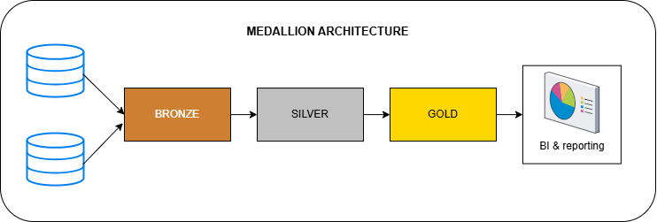

## Pendahuluan
Medallion Architecture adalah kerangka kerja manajemen data modern yang dirancang untuk mengatur dan memproses data secara terstruktur dalam lingkungan data lakehouse. Pertama kali diperkenalkan oleh Databricks dan diadopsi oleh platform seperti Microsoft Fabric, arsitektur ini bertujuan untuk meningkatkan kualitas data, tata kelola, dan kegunaan data dengan membagi proses pengelolaan data menjadi tiga lapisan utama: Bronze, Silver, dan Gold. Pendekatan ini sangat relevan di era big data, di mana volume data global diperkirakan meningkat dari 64,2 zettabyte pada 2020 menjadi 181 zettabyte pada 2025, menurut Bismart. Laporan ini akan menjelaskan komponen utama, manfaat, kasus penggunaan, implementasi, dan tantangan Medallion Architecture.

## Komponen Utama Medallion Architecture
Medallion Architecture mengatur data dalam tiga lapisan yang masing-masing memiliki fungsi spesifik untuk meningkatkan kualitas dan kegunaan data secara bertahap.

|  | Bronze Layer | Silver Layer | Gold Layer |
|---------------|---------------|---------------|---------------|
| Definition | Raw, Unprocessed data as-is from sources | Clean & Standardized data | Business-Ready data |
| Objective | Traceablity & Debugging | (Intermediate Layer) Prepare Data for Analysis | Provide Data to be consumed for reporting & Analytics |
| Object Type | Tables | Tables |
| Load Method | Full Load (Truncate & Insert) | Full Load (Truncate & Inseret) | Views | None |
| Data Transformation | None (as-is) | Data Cleaning, Data Standardization, Data Normalization, Derived Columns, Data Enrichment | Data Integration, Data Aggregation, Business Logic & Rules |
| Data Modeling | None (as-is) | None (as-is) | Start Schema, Aggregated Objects, Flat Tables |
| Target Audience | Data Engineers | Data Analysts, Data Engineers | Data Analysts, Business Users |

- Lapisan Bronze
Ini adalah lapisan pertama, menyimpan data mentah langsung dari sumber seperti database atau file CSV. Tujuannya untuk pelacakan dan debugging, digunakan oleh data engineers. Data disimpan sebagai tabel dengan metode muat full load (truncate & insert), tanpa transformasi atau pemodelan data.

- Lapisan Silver
Lapisan ini membersihkan dan menstandarkan data dari Bronze untuk analisis awal. Digunakan oleh data analysts dan engineers, data disimpan sebagai tabel, dengan transformasi seperti pembersihan, normalisasi, dan pengayaan. Metode muatnya juga full load, tanpa pemodelan data.

- Lapisan Gold
Lapisan terakhir ini menyediakan data siap bisnis untuk pelaporan dan analitik. Digunakan oleh data analysts dan pengguna bisnis, data disajikan sebagai views, dengan transformasi seperti integrasi dan agregasi, serta pemodelan seperti star schema. Tidak ada metode muat spesifik karena views dinamis.

## Definisi dan Struktur Arsitektur Medallion
